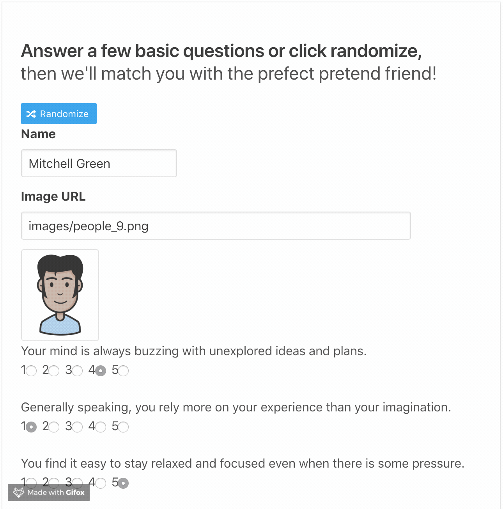

This web application takes in the results from a user survey, then compare their answers with those from an object containing pretend people. The app will then display the name and picture of the pretend person with the best overall match. The users, along with their answers will then be added to the object so they can be other people's match in the future.

[Live Site](https://pretend-friend.herokuapp.com/)

### Run
`node server.js`

### Technologies 

* <a href="https://bulma.io/">Bulma</a> - a modern CSS framework based on Flexbox  
* <a href="https://handlebarsjs.com/">Handlebars</a> - a minimal templating engine  
* <a href="https://expressjs.com/">Express</a> - a node.js web application framework  
* <a href="https://fontawesome.com/">Font Awesome</a> - icons designed for the web  

 

 
 

Avatars designed by <a href="https://www.freepik.com/graphicrepublic">Graphicrepublic</a>

